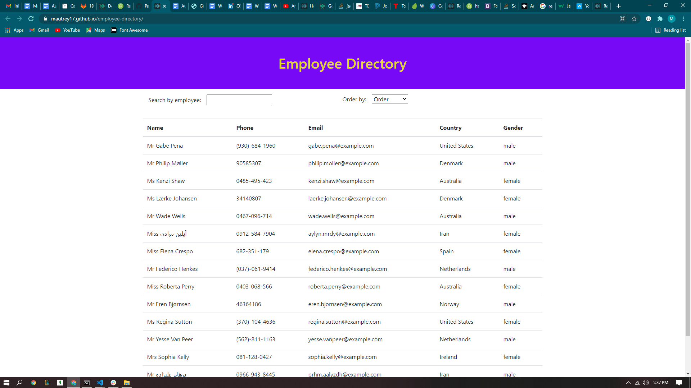

# Employee Directory

## Table of Contents
1. [Description](#Description)
2. [Installation](#Installation)
3. [Usage](#Usage)
4. [License](#License)
5. [Contributing](#Contributing)
6. [Questions](#Questions)

## Description
This React application pulls fake employees from the RandomUser API, displays them in a table. Users can then search by name or order by various categories.

## Installation
In order to install the application, follow these steps: 

Visit the website: https://mautrey17.github.io/employee-directory/

## Usage
NA

## License
This application is not protected under a license

## Contributing
NA

## Tests
In order to test the application, follow these steps:

NA

## Questions
You can find my other applications on my github page
Github: [mautrey17](https://github.com/mautrey17) 

Or you can email me at: mautrey17@gmail.com

